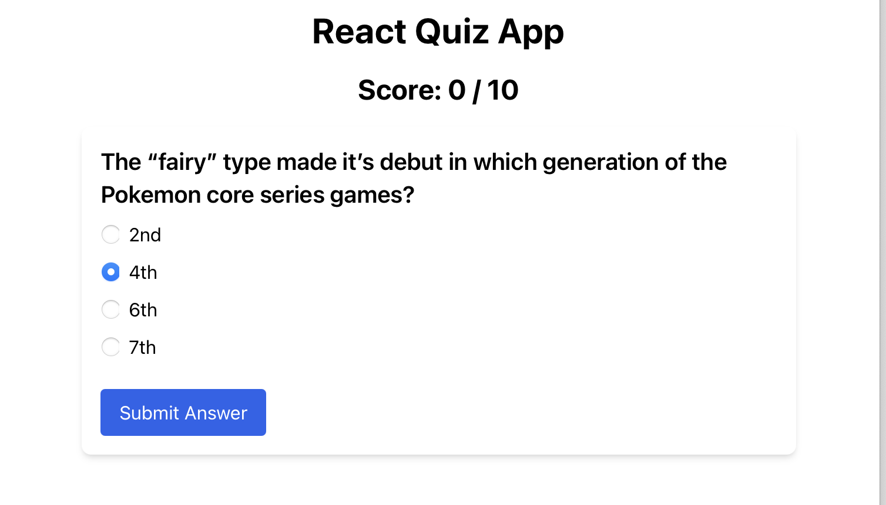

# React Quiz App

A simple React quiz application that fetches questions from the Open Trivia Database API. Users can take a quiz, see their score, and reset the quiz to start over with a new set of questions.

## Quiz-App

## Features

- Fetches multiple-choice questions from the Open Trivia Database API
- Displays the user's current score
- Allows users to reset the quiz and start over with new questions

## Technologies Used

Open Trivia Database API
Tailwind CSS
REACT 

## Components

### `App.js`

The main component that manages the state and controls the flow of the application. It fetches questions from the API and renders the `QuizList` and `Score` components.

### `QuizList.js`

Renders the list of quiz questions one at a time. It handles the logic for moving to the next question and updating the score.

### `Question.js`

Displays a single quiz question and its multiple-choice answers. It handles the logic for submitting an answer and determining if the selected answer is correct.

### `Score.js`

Displays the current score and the total number of questions.

## Installation
1. Clone the repository:
git clone https://github.com/your-username/react-quiz-app.git
cd react-quiz-app

2. Install the dependencies:
npm install

3. Start the development server:
npm start

The app should now be running on http://localhost:3000

## Usage
1. Open the app in your browser.
2. The app will fetch 10 multiple-choice questions from the Open Trivia Database API.
3. Answer each question by selecting an option and clicking the "Submit Answer" button.
4. The current score will be displayed at the top of the page.
5. Once all questions have been answered, a "Restart Quiz" button will appear. Click this button to reset the quiz and start over with a new set of questions.

## Authors

### Nicolai Odongo
### Stacy Alyiela
